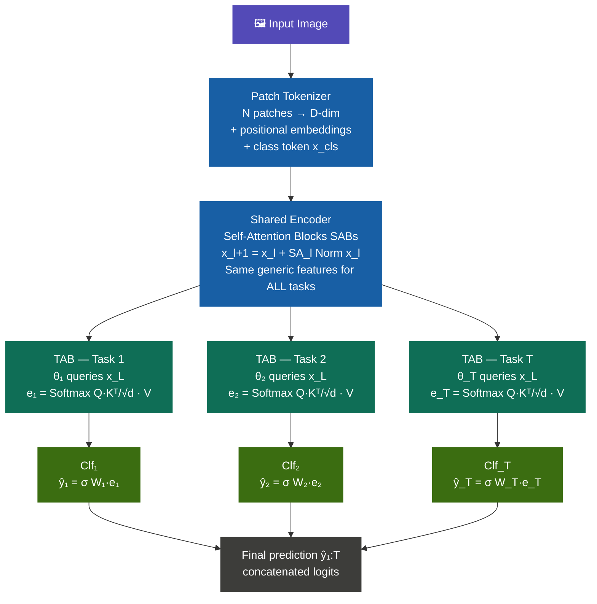
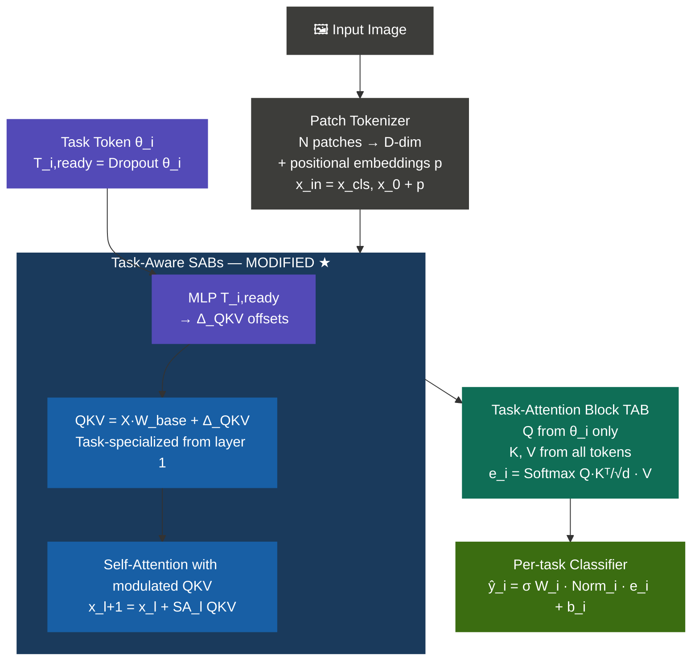
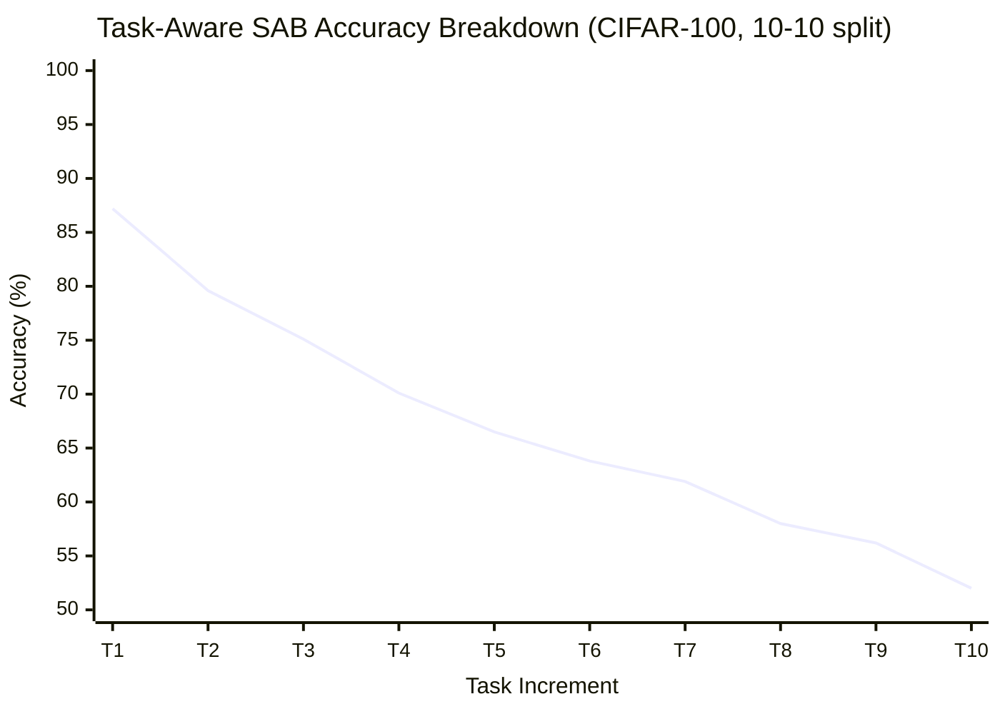
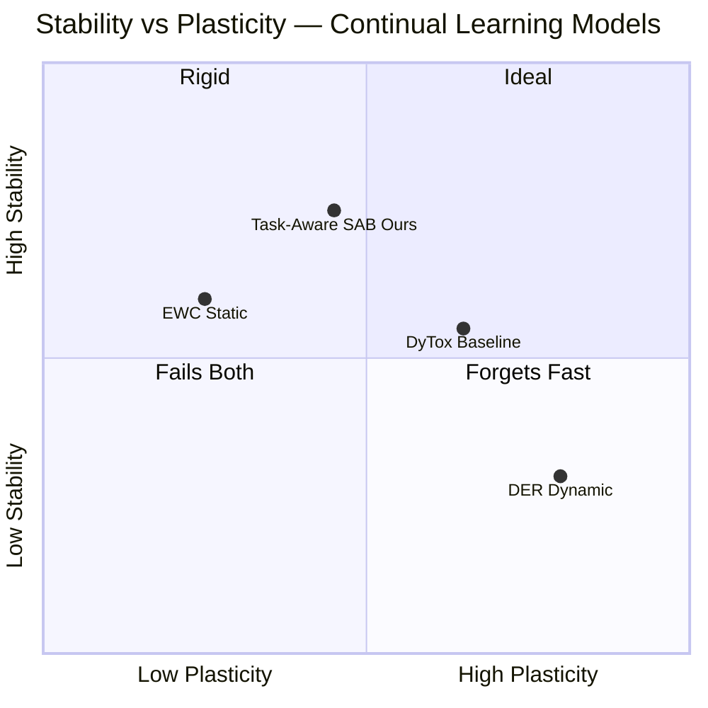

<div align="center">

# DyTox-ADL

### Experimental Architectural Extensions to Dynamic Token Expansion for Continual Learning

[](https://pytorch.org)
[](https://github.com/rwightman/pytorch-image-models)
[](https://python.org)
[](.)
[](https://github.com/arthurdouillard/dytox)

> A course research project implementing, replicating, and architecturally extending **DyTox** (Douillard et al., 2022). This repository focuses on **faithful replication + the Task-Aware SAB encoder**.
> *(Note: A second modification, Dynamic Contextual Positional Embeddings, was explored by my project partner [Taashif Bashar](https://github.com/TaashifBashar) in a separate repository.)*

**Pranjal Upadhyay · Advanced Deep Learning · Oct 2025**

</div>

---

## The Research Question

> *Can injecting task identity into the encoder — not just the decoder — reduce catastrophic forgetting in continual learning?*

In the baseline DyTox network, the encoder is heavily shared and entirely task-agnostic. Specialization for different tasks only happens at the TAB decoder stage. This project tests whether modulating QKV projections in every SAB (Self-Attention Block) with the current task token creates task-separated feature spaces, which should directly reduce catastrophic forgetting.

**Primary metric: Forgetting.** In continual learning, forgetting measures how much performance on old tasks degrades as new tasks are learned. Reducing forgetting — not just maintaining accuracy — is the core scientific goal.

---

## Background: What is DyTox Baseline?

[DyTox](https://arxiv.org/abs/2111.11326) (Douillard et al., 2022) tackles **catastrophic forgetting** — the tendency of neural networks trained on sequential tasks to degrade on earlier tasks.

**The core insight:** Instead of growing a whole new feature extractor per task, DyTox adds only a tiny learnable *task token* (~384 parameters) per new task. The shared backbone retains old knowledge; task tokens specialize the decoder.

### DyTox Baseline Architecture



> **Key:** Q comes from the task token only (not patch tokens). This asymmetric attention is what lets each task token "query" the shared patch features independently — enabling task-specific embeddings with shared parameters.

---

## Architecural Extension: Task-Aware SAB Encoder

### Hypothesis

The original DyTox encoder is completely blind to task identity. My hypothesis: if we modulate the QKV projections in each SAB using the current task token, the encoder will learn task-separated feature spaces from layer 1 — reducing inter-task interference in memory and therefore reducing forgetting.

### Implementation

Each SAB receives `T_i,ready = Dropout(T_i)` and generates additive offsets to Q, K, V:

```
Δ_QKV         = MLP(T_i,ready)
QKV_modulated = X · W_base + Δ_QKV
```

### Modified Architecture Config Data Flow



---

## Results & Experiments

### Experiment A: Faithful Replication (Baseline)

Before testing modifications, we faithfully replicated the DyTox paper's corrected results (erratum Table 16) on CIFAR-100 using a single GPU.

| Metric | Paper (erratum) | Ours (Replicated) |
|---|---|---|
| Avg Accuracy — CIFAR100, 2-2 split, 50 tasks | ~62% | **62.17%** |
| Final Accuracy — last task | ~45% | **45.23%** |
| Training time | — | ~13 hours (12h 51m 32s) |

✅ Results match the paper's corrected erratum to within 0.1% — confirming implementation fidelity.

### Experiment B: Task-Aware SAB vs Baseline

| Model | Protocol | Avg Accuracy | **Forgetting** | Training Time |
|---|---|---|---|---|
| **DyTox Baseline** | 10-10 split, 10 tasks | 70.30% | ~18.7% | ~13 hours |
| **Task-Aware SAB (ours)** | 10-10 split, 10 tasks | 54.65% | **14.8% ↓** | ~28.7 hours |

> **The headline result: catastrophic forgetting is reduced by ~4% absolute (14.8% vs 18.7%).** Task-conditioning the encoder creates more separated feature spaces, effectively reducing inter-task interference in memory.

### Accuracy Breakdown per Task (Task-Aware, 10-10 split)

| Task Step | 1 | 2 | 3 | 4 | 5 | 6 | 7 | 8 | 9 | 10 |
|---|---|---|---|---|---|---|---|---|---|---|
| Incremental Accuracy (%) | 87.2% | 79.6% | 75.1% | 70.1% | 66.5% | 63.8% | 61.9% | 58.0% | 56.2% | 52.0% |

**Visualized Accuracy Curve:**



### Interpreting the Stability-Plasticity Tradeoff

The Task-Aware SAB produces a clear tradeoff:



**Task-Aware SAB trades plasticity for stability.** Forgetting drops because the encoder builds more separated feature spaces per task (higher stability/retention). But per-task discriminability can suffer slightly in easier splits because the encoder is less structurally free to learn purely generic features at each stage.

---

## Tech Stack

| Component | Library | Version |
|---|---|---|
| Deep learning | PyTorch | ≥ 2.9.0 |
| Vision models | torchvision | ≥ 0.24.0 |
| Pretrained backbones | timm | 0.4.12 |
| Continual learning | continuum | 1.0.27 |
| Config management | PyYAML | ≥ 6.0.3 |
| Training | Distributed (torch.distributed), AMP | — |

---

## Repository Structure

```
.
├── cli.py                       # Main entrypoint — training loop, task iteration
├── dytox.py                     # Core DyTox module — task tokens, divergence head ★
├── classifier.py                # Linear/cosine classifiers, head expansion
├── factory.py                   # Backbone builder, dataloader builders ★
├── engine.py                    # Train/eval loop — SAM/Look-SAM, POD ★
├── losses.py                    # Distillation loss, soft BCE
├── pod.py                       # POD distillation loss
├── sam.py                       # SAM / Look-SAM optimizer wrapper ★
├── rehearsal.py                 # Rehearsal memory, balanced finetuning
├── backbones/
│   ├── convit.py                # ConViT + ClassAttention/JointCA (Task-Aware SABs) ★
│   ├── resnet_scs.py            # SCS CNN backbone variants ★
│   └── [vit, resnet, vgg ...]   # Full backbone registry
├── datasets.py                  # CIFAR100, ImageNet100/1000 loaders
├── src/adl/configs/
│   ├── model/*.yaml             # DyTox / DyTox+ / DyTox++ hyperparams
│   └── data/*.yaml              # CIFAR/ImageNet class orders and splits
├── assets/                      # Result plots and diagrams
├── logs_singleGPU/              # Training logs + checkpoints
├── train.sh                     # Distributed launcher
└── UPSTREAM_README.md           # Original DyTox documentation

★ = files containing experimental modifications
```

---

## How to Run

**Setup**
```bash
git clone https://github.com/PranjalUpadhyay7/dytox
cd dytox
pip install -e .
```

**Replicate baseline — CIFAR100 2-2 split**
```bash
adl \
  --options src/adl/configs/model/dytox.yaml \
            src/adl/configs/data/cifar100_2-2.yaml \
  --initial-increment 2 --increment 2 \
  --memory-size 2000 \
  --name dytox_baseline
```

**Run Task-Aware SAB modification (Task 1)**
```bash
adl \
  --options src/adl/configs/model/dytox.yaml \
            src/adl/configs/data/cifar100_2-2.yaml \
  --initial-increment 2 --increment 2 \
  --memory-size 2000 \
  --task-aware-encoder \
  --name task_aware_singleGPU
```

**CIFAR-100 10-10 split**
```bash
adl \
  --options src/adl/configs/model/dytox.yaml \
            src/adl/configs/data/cifar100_10-10.yaml \
  --initial-increment 10 --increment 10 \
  --memory-size 2000
```

**Eval only**
```bash
adl --options src/adl/configs/model/dytox.yaml \
    --eval-only --resume path/to/checkpoint.pth
```

**Multi-GPU**
```bash
bash train.sh
```

---

## Future Work

- [ ] Full ablation: task-aware encoder vs baseline across all CIFAR100 splits (2-2 / 5-5 / 10-10 / 20-20) to precisely map the regime boundary
- [ ] Adaptive task-modulation: activate task-aware encoder only when per-task sample count < threshold N
- [ ] SAM/Look-SAM interaction: does sharpness-aware optimization amplify forgetting reduction from task-aware features?
- [ ] ImageNet-100 incremental benchmarks
- [ ] Unit tests for factory and backbone selection

---

## Citation

```bibtex
@article{douillard2021dytox,
  title     = {DyTox: Dynamic Token Expansion for Continual Learning},
  author    = {Douillard, Arthur and Ram{\'e}, Alexandre and Couairon, Guillaume and Cord, Matthieu},
  journal   = {arXiv preprint arXiv:2111.11326},
  year      = {2021}
}
```

---

<div align="center">
<sub>
Task 1 implementation by <a href="https://github.com/PranjalUpadhyay7">Pranjal Upadhyay</a> &nbsp;·&nbsp;
Advanced Deep Learning, Oct 2025 &nbsp;·&nbsp;
Built on <a href="https://arxiv.org/abs/2111.11326">DyTox (Douillard et al., 2022)</a>
</sub>
</div>
